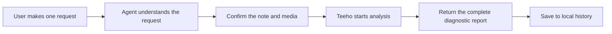

<div align="center">


# 🔥 Teeho

🌐 [简体中文](README.md) · **English** · [繁體中文](README.zh-TW.md)

📦 [Use online](https://teeho.chat)

**Start a diagnosis with one sentence through an Agent Skill**

</div>

Provide your note's title, body, topics, cover, images, and video. Using `Xiaohongshu platform-wide data`, the backend matches it with high-performing notes and returns `analysis results` containing quantitative metrics and recommendations.

## 🔧 Design philosophy

### **Quantitative analysis**

Teeho feeds collected note data into its proprietary `Insight Model`. `Machine learning` produces a continuously updated model on which all subsequent scoring is based—similar to quantitative trading, where large volumes of candlestick data are used to build an investment model.

### **AI**

The Agent understands the images and videos uploaded by the user, passes that understanding to the `Insight Model`, and presents the analysis report.

### **Big data**

Many Teeho accounts collect note data around the clock. As the `Insight Model` is trained on more data, its scoring becomes increasingly accurate.

## 🚀 Quick start

### **1. Install**

#### Option 1: Send this request to your Agent (recommended)

```text
Install or upgrade the Teeho Agent Skill by following https://teeho.chat/skill-install.md.
```

#### Option 2: Install from source

Clone the repository. For a production or reproducible installation, choose a Tag from [Releases](https://github.com/mingzhizhiren/teeho/releases) and pin it with `--branch <release-tag>`. The commands below retrieve the latest development source:

```bash
git clone --depth 1 https://github.com/mingzhizhiren/teeho.git
cd teeho
```

`skills/teeho/` is a complete, self-contained installable directory. Copy the entire directory into the target Agent's officially supported Skill directory and keep its name as `teeho`.

If the destination exists, check its version and back it up first. Do not merge old and new files in place. Then validate from the final installation location:

```bash
python -B -S -X utf8 "<AGENT_SKILLS_DIR>/teeho/tools/teeho.py" installation
python -B -S -X utf8 "<AGENT_SKILLS_DIR>/teeho/tools/teeho.py" help
```

Both commands should emit newline-delimited JSON successfully. `installation` should return `state: ready`; `help` should return a non-empty `displayText` and help-topic list.

#### Option 3: Install a GitHub Release package

Download `teeho-agent-skill.zip` from [GitHub Releases](https://github.com/mingzhizhiren/teeho/releases). Extraction should produce a top-level `teeho/` directory. Verify its version and file list, then install it into the target Agent's Skill directory. The Release package is a validated minimal runtime package without tests, caches, or user data.

### **2. Run your first diagnosis**

#### Attach the cover and other images correctly, then send the note information. Do not paste images directly into your Agent with Ctrl+C, because the Agent may be unable to locate the files.

```text
Diagnose this Xiaohongshu note. Here are its title, body, topics, and images...
```


#### You can also select a prepared media folder:

```text
Diagnose the Xiaohongshu note in this folder: D:\Notes\my-post
```

#### Example result:

Use the analysis to improve your note and compare its performance with that day's platform-wide benchmark.

```text
🔥 Teeho · Note Diagnosis
✨ Available credits: 35

[Diagnosis complete]

🎯 Insight Engine score: 4.22 / 10 ⬜
Median score for similar notes: 4.54
Highest score for similar notes: 6.19
Lowest score for similar notes: 2.89

════════════════════════════════════════

[Content analysis]

Content consistency: ★★★★☆ (4/5)
The title, body, and images all focus on making coffee, latte art, and photography at home. However, the “natural light by the window” and at-home café atmosphere are not clearly shown.
• Body: "First, find natural light by a window"
  The current cover and description mainly show a dark tabletop and work surface, which do not clearly convey natural window light.
• Title: "Create a café atmosphere at home"
  The images show coffee and latte art, but not enough context to confirm an at-home setting or café atmosphere.

Weaknesses compared with reference notes
No evidence-based weaknesses found

⚠️ High-risk wording
🔎 Most - Body: Superlative or absolute promotional wording; ordinary adjectives should be checked in context.

════════════════════════════════════════

[Key note metrics]

Title length: 10 · Average
Reference range: 13.5 ~ 18.5

Title emoji ratio: 0% · Excellent
Reference range: 0% ~ 5.36%

Body length: 179 · Poor
Reference range: 65.5 ~ 113

Average paragraph length: 88.5 · Excellent
Reference range: 65.5 ~ 113

List/step items: 0 · Excellent
Reference range: 0 ~ 0

Topics: 7 · Poor
Reference range: 9.75 ~ 10

...

════════════════════════════════════════

[Similar notes]

📕 “Why are humans so fascinated by blue?”
#StruckByColor #LifeIsLikeTheBlues...
https://www.xiaohongshu.com/explore/xxx
Likes: 1K+ · Saves: 1K+ · Comments: 100+
Selection reason: Rapid growth

📕 I once had this at a relative's home, and it was truly amazing!
Today we had noodle soup, and it was so delicious! The noodles were fully coated...
https://www.rednote.com/search_result/xxx
Likes: 10K+ · Saves: 10K+ · Comments: 100+
Selection reason: High exposure

📕 🤳｜16 photo poses that let you skip standing stiffly
#OneMinutePhotoInspiration #PosesForWomen #PhotoComposition...
https://www.xiaohongshu.com/explore/xxx
Likes: 1K+ · Saves: 1K+ · Comments: Growing rapidly
Selection reason: Rapid growth

...
```

### **3. Continue in later conversations**

```text
Check the current diagnosis progress.

Show the complete analysis result.

Show my past analysis reports.

How do I use Teeho?
```

## 👀 Teeho in one minute



Teeho packages a complex analysis workflow into an Agent Skill. Users do not need to find high-performing notes of the same type or trending information, or manually diagnose a note before publishing. This saves optimization time and lets creators focus on their content.

After diagnosis, the Agent delivers a complete report containing the median, lowest, and highest scores of high-performing notes, together with optimization recommendations.

## 🙋 Frequently asked questions

<details>
<summary><strong>Will Teeho write or rewrite my Xiaohongshu note?</strong></summary>

No. Teeho only diagnoses existing content. It does not ghostwrite notes or append unsolicited rewrites after a report.

</details>

<details>
<summary><strong>What input does Teeho support?</strong></summary>

Teeho supports local media folders containing images or video attached to a note. The body may be empty, but a diagnosis requires a title, topics, and cover.

</details>

<details>
<summary><strong>Is Teeho tied to one specific Agent?</strong></summary>

Teeho is distributed as an Agent Skill and works through its bundled Python CLI. It is not tied to one Agent product. Compatibility depends on whether the host can read Skills, execute local Python, and reach the Teeho service.

</details>

<details>
<summary><strong>What data is sent to the Teeho service?</strong></summary>

After diagnosis starts, the confirmed note text and media are sent to Teeho for processing. Sign-in credentials remain in the user data directory; they are neither written to the Skill source nor returned to the Agent. Only submit content you are authorized to process.

</details>

<details>
<summary><strong>Where are past reports stored?</strong></summary>

Signed-in reports are isolated by account and stored locally. Anonymous reports are plain text in a shared local history directory and may be readable by other users of the same system. Clearing history does not delete original media.

</details>

<details>
<summary><strong>Is Teeho free?</strong></summary>

Users receive free daily credits for analyzing image notes. The ✨ credit system keeps the author's token costs sustainable.

Video analysis is not currently free and requires the Coffee plan.

Teeho collects large volumes of note data through crawlers, while video analysis consumes substantial tokens. The author cannot afford to provide video analysis to everyone for free 🙏

</details>

## 📌 What's next

- 📝 Add metrics and strengthen the model so scoring becomes more accurate and quantitative metrics become easier to understand.
- 📝 Teeho's Agent Skill is currently source-available. The web client and backend will be released progressively, together with plugin customization interfaces. Developers will be able to use their own note data to customize quantitative algorithms and produce analysis results.

It would be my honor if this tool helps you 👍

***

## License and commercial use

This repository uses the [PolyForm Noncommercial License 1.0.0](LICENSE.md): noncommercial use, modification, and redistribution are permitted, but commercial use requires separate written authorization. This is a source-available project, not OSI-certified open-source software.

For commercial use, contact me via `email (mingzhizhiren@outlook.com) / WeChat` to discuss a commercial license.

## Join the Teeho technical community


