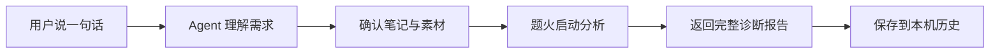

<div align="center">


# 🔥题火 Teeho

🌐 **简体中文** | [简体中文](README.md) · [English](README.EN.md) · [繁體中文](README.zh-TW.md)

📦 [在线使用](https://teeho.chat)

**支持agent skill一句话开启诊断**

</div>

输入你的笔记内容（标题、正文、话题、封面、图片、视频），后端会根据 `小红书大盘数据` 匹配优秀笔记，从而对你的笔记进行诊断并得出 `分析结果` 包括量化指标和改进说明

## 🔧 设计理念

### **量化**

题火后台使用自研的 `洞察模型` ，将爬取的笔记数据输入到模型，通过 `机器学习` 产生一个模型（持续更新），后续的评分都依赖该模型

原来类似量化交易，将大量K线数据输入并产生自己的投资模型

### **AI**

由Agent分析用户上传的笔记图片、视频，并输入 `洞察模型` 进行理解；除此之外Agent还担任分析报告角色

### **大数据**

题火后台目前有大量账号正在 7 × 24 小时不停爬取笔记数据，经过大量训练的 `洞察模型` 评分会越来越准确

## 🚀 快速开始

### **1. 安装**

#### 🔴 方式一：一句话安装，将下面这句话复制给你的 Agent（推荐）

```text
请根据 https://teeho.chat/skill-install.md 的说明安装或升级题火 Agent Skill。
```

如果无法访问 `teeho.chat`，请改用 GitHub 安装说明：

```text
请根据 https://github.com/mingzhizhiren/teeho/blob/main/docs/skill-install.md 的说明安装或升级题火 Agent Skill。
```

#### 方式二：使用源码安装

克隆仓库。正式或可复现安装应从 [Releases](https://github.com/mingzhizhiren/teeho/releases) 页面选择一个 Tag，并通过 `--branch <release-tag>` 固定版本；下面的命令获取最新开发源码：

```bash
git clone --depth 1 https://github.com/mingzhizhiren/teeho.git
cd teeho
```

仓库中的 `skills/teeho/` 是完整、自包含的可安装目录。将整个目录复制到目标 Agent 官方支持的 Skill 目录，并保持目录名为 `teeho`。

如果目标已经存在，请先确认版本并备份，不要直接混合覆盖新旧文件。随后从最终安装位置执行本地验证：

```bash
python -B -S -X utf8 "<AGENT_SKILLS_DIR>/teeho/tools/teeho.py" installation
python -B -S -X utf8 "<AGENT_SKILLS_DIR>/teeho/tools/teeho.py" help
```

两个命令都应成功输出逐行 JSON；`installation` 应返回 `state: ready`，`help` 应返回非空的 `displayText` 和帮助主题列表。

#### 方式三：安装 GitHub Release 包
从 [GitHub Releases](https://github.com/mingzhizhiren/teeho/releases) 下载 `teeho-agent-skill.zip`。解压后应得到顶层 `teeho/` 目录；核对版本和文件清单后，将它安装到目标 Agent 的 Skill 目录。Release 包是经过验证的最小运行包，不包含测试、缓存或用户数据。

### 🔴 2. 开始第一次诊断

#### 正确附加封面以及笔记其他图片，然后发送笔记信息（注意不要ctrl+c直接复制图片给你的Agent，因为Agent会看不到这张图片的具体位置）

```text
诊断这篇小红书笔记，标题、正文、话题和图片如下……
```


#### 也可以直接选择整理好的素材文件夹：

```text
诊断这个文件夹里的小红书笔记：D:\Notes\my-post
```

#### 生成结果如下：

可以根据分析结果对你的笔记进行优化调整，以及对比当天大盘你的笔记算好还是算差。

```text
🔥 题火 · 笔记诊断
✨ 当前可用积分 35

【诊断完成】

🎯 洞察引擎评分: 4.22 / 10 ⬜
同类笔记模型中位分: 4.54
同类笔记模型最高分: 6.19
同类笔记模型最低分: 2.89

════════════════════════════════════════

【内容分析】

内容一致性: ★★★★☆ (4/5)
标题、正文与图片均围绕居家咖啡制作、拉花和拍摄展开，整体一致；但“窗边自然光”和居家咖啡店氛围在画面中未得到明确呈现。
• Body: "先找窗边自然光"
  现有封面与内容描述主要为深色桌面和操作台，未能明确对应窗边自然光。
• Title: "在家拍出咖啡店氛围感"
  图片明确呈现咖啡与拉花，但未提供足够环境信息以确认“在家”或咖啡店氛围。

相较参考笔记的不足
未发现有依据的不足

⚠️ 高风险用词
🔎 最 - Body: 推广中的极限或绝对化表达；普通形容词需核对上下文。

════════════════════════════════════════

【笔记关键指标】

标题长度: 10 · 一般
同类参考范围: 13.5 ~ 18.5

标题 Emoji 比例: 0% · 优秀
同类参考范围: 0% ~ 5.36%

正文长度: 179 · 较差
同类参考范围: 65.5 ~ 113

平均段落长度: 88.5 · 优秀
同类参考范围: 65.5 ~ 113

列表/步骤项数量: 0 · 优秀
同类参考范围: 0 ~ 0

话题数量: 7 · 较差
同类参考范围: 9.75 ~ 10

...

════════════════════════════════════════

【同类笔记】

📕 “人类为何如此迷恋蓝色”
#被色彩击中的瞬间 #生活就像是一场蓝调...
https://www.xiaohongshu.com/explore/xxx
点赞: 1K+ · 收藏: 1K+ · 评论: 100+
入选原因: 快速增长

📕 有幸在亲戚家吃过一次，真的是惊艳到我了！
今天吃炝锅面，真的是泰好吃了！ 面条裹满...
https://www.rednote.com/search_result/xxx
点赞: 1W+ · 收藏: 1W+ · 评论: 100+
入选原因: 高曝光

📕 🤳｜拒绝罚站的1️⃣6️⃣种拍照姿势
#一分钟拍照灵感#女生拍照姿势#拍照构图...
https://www.xiaohongshu.com/explore/xxx
点赞: 1K+ · 收藏: 1K+ · 评论: 增长迅速
入选原因: 快速增长

...

```

### **3. 在后续对话中继续**

```text
查看当前诊断进度。

显示完整分析结果。

查看我过去的分析报告。

请告诉我题火如何使用？
```

## 👀 一分钟看懂题火



题火把复杂的分析流程封装在 Agent Skill 中。用户不需要自己搜索同类型优秀笔记以及热点信息，无需人工做发布前诊断，节省诊断优化笔记时间，让创作者集中精力在笔记内容上。

诊断完成后，Agent 会交付完整报告，报告包括优秀笔记评分中位数、最低分、最高分以及优化意见

## 🙋 常见问题

<details>
<summary><strong>题火会帮我撰写或改写小红书笔记吗？</strong></summary>

不会。题火只诊断已有内容，不代写笔记，也不会在报告之后擅自附加改写方案。

</details>

<details>
<summary><strong>题火支持哪些输入？</strong></summary>

支持笔记中附加图片或视频的本机素材文件夹。正文可以为空，但诊断需要标题、话题和封面。

</details>

<details>
<summary><strong>题火只能在某个特定 Agent 中使用吗？</strong></summary>

题火以 Agent Skill 形式分发，通过随附的 Python CLI 工作，不绑定单一 Agent 产品。实际可用性取决于宿主是否支持读取 Skill、执行本机 Python 和访问题火服务。

</details>

<details>
<summary><strong>哪些数据会发送到题火服务？</strong></summary>

启动诊断后，用户确认的笔记文字和媒体会发送到题火服务处理。登录凭据保存在用户数据目录中，不写入 Skill 源码，也不会返回给 Agent。请只提交你有权处理的内容。

</details>

<details>
<summary><strong>历史报告保存在哪里？</strong></summary>

已登录账号的报告按账号隔离保存在本机。匿名报告以明文保存在公共本机历史目录中，同一系统的其他用户可能读取。清理历史不会删除原始素材。

</details>

<details>
<summary><strong>题火收费吗？</strong></summary>

用户有免费额度（每日积分）可用于图片笔记的分析，通过✨积分来保证作者的token不被击穿

但是视频目前不支持免费（如果需要视频分析需要购买Coffee套餐）。

题火后台有大量的笔记数据都是靠爬虫爬取，视频分析需要消耗大量的token，以作者的经济实力无法支持大家免费使用视频分析功能🙏

</details>

## 📌 后续工作

- 📝 新增指标与强化模型，让评分更加精确，让量化指标更通俗易懂
- 📝 暂时开源了题火的agent技能，后续会陆续开源题火的网页客户端以及后端代码，并提供插件定制接口。让开发者可以根据自己的需求，使用自己的笔记数据定制量化算法并产生分析结果

如果我做的工具可以帮助到你，那将是我的荣幸👍

***


## 许可证与商业使用

本仓库采用 [PolyForm Noncommercial License 1.0.0](LICENSE.md)：允许非商业使用、修改和再分发，
但未经单独书面授权不得用于商业目的。本项目属于源码开放（source-available）项目，不是 OSI
认证的开源软件。

如需商业使用，请通过 `邮箱(mingzhizhiren@outlook.com) / 微信` 联系协商商业许可。

## 加入题火技术交流群

