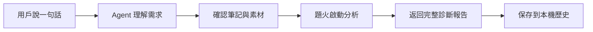

<div align="center">


# 🔥題火 Teeho

🌐 [简体中文](README.md) · [English](README.en.md) · **繁體中文**

📦 [在線使用](https://teeho.chat)

**支持agent skill一句話開啟診斷**

</div>

輸入你的筆記內容（標題、正文、話題、封面、圖片、視頻），後端會根據 `小紅書大盤數據` 匹配優秀筆記，從而對你的筆記進行診斷并得出 `分析結果` 包括量化指標和改進說明

## 🔧 設計理念

### **量化**

題火後臺使用自研的 `洞察模型` ，將爬取的筆記數據輸入到模型，通過 `機器學習` 產生一個模型（持續更新），後續的評分都依賴該模型

原來類似量化交易，將大量K線數據輸入并產生自己的投資模型

### **AI**

由Agent分析用戶上傳的筆記圖片、視頻，并輸入 `洞察模型` 進行理解；除此之外Agent還擔任分析報告角色

### **大數據**

題火後臺目前有大量賬號正在 7 × 24 小時不停爬取筆記數據，經過大量訓練的 `洞察模型` 評分會越來越準確

## 🚀 快速開始

### **1. 安裝**

#### 🔴 方式一：一句話安裝，將下面這句話復制給你的 Agent（推薦）

```text
請根據 https://teeho.chat/skill-install.md 的說明安裝或升級題火 Agent Skill。
```

如果無法訪問 `teeho.chat`，請改用 GitHub 安裝說明：

```text
請根據 https://github.com/mingzhizhiren/teeho/blob/main/docs/skill-install.md 的說明安裝或升級題火 Agent Skill。
```

#### 方式二：使用源碼安裝

克隆倉庫。正式或可復現安裝應從 [Releases](https://github.com/mingzhizhiren/teeho/releases) 頁面選擇一個 Tag，并通過 `--branch <release-tag>` 固定版本；下面的命令獲取最新開發源碼：

```bash
git clone --depth 1 https://github.com/mingzhizhiren/teeho.git
cd teeho
```

倉庫中的 `skills/teeho/` 是完整、自包含的可安裝目錄。將整個目錄復制到目標 Agent 官方支持的 Skill 目錄，并保持目錄名為 `teeho`。

如果目標已經存在，請先確認版本并備份，不要直接混合覆蓋新舊文件。隨后從最終安裝位置執行本地驗證：

```bash
python -B -S -X utf8 "<AGENT_SKILLS_DIR>/teeho/tools/teeho.py" installation
python -B -S -X utf8 "<AGENT_SKILLS_DIR>/teeho/tools/teeho.py" help
```

兩個命令都應成功輸出逐行 JSON；`installation` 應返回 `state: ready`，`help` 應返回非空的 `displayText` 和幫助主題列表。

#### 方式三：安裝 GitHub Release 包

從 [GitHub Releases](https://github.com/mingzhizhiren/teeho/releases) 下載 `teeho-agent-skill.zip`。解壓后應得到頂層 `teeho/` 目錄；核對版本和文件清單后，將它安裝到目標 Agent 的 Skill 目錄。Release 包是經過驗證的最小運行包，不包含測試、緩存或用戶數據。

### 🔴 2. 開始第一次診斷

#### 正確附加封面以及筆記其他圖片，然后發送筆記信息（注意不要ctrl+c直接復制圖片給你的Agent，因為Agent會看不到這張圖片的具體位置）

```text
診斷這篇小紅書筆記，標題、正文、話題和圖片如下……
```


#### 也可以直接選擇整理好的素材文件夾：

```text
診斷這個文件夾里的小紅書筆記：D:\Notes\my-post
```

#### 生成結果如下：

可以根據分析結果對你的筆記進行優化調整，以及對比當天大盤你的筆記算好還是算差。

```text
🔥 題火 · 筆記診斷
✨ 當前可用積分 35

【診斷完成】

🎯 洞察引擎評分: 4.22 / 10 ⬜
同類筆記模型中位分: 4.54
同類筆記模型最高分: 6.19
同類筆記模型最低分: 2.89

════════════════════════════════════════

【內容分析】

內容一致性: ★★★★☆ (4/5)
標題、正文與圖片均圍繞居家咖啡制作、拉花和拍攝展開，整體一致；但“窗邊自然光”和居家咖啡店氛圍在畫面中未得到明確呈現。
• Body: "先找窗邊自然光"
  現有封面與內容描述主要為深色桌面和操作臺，未能明確對應窗邊自然光。
• Title: "在家拍出咖啡店氛圍感"
  圖片明確呈現咖啡與拉花，但未提供足夠環境信息以確認“在家”或咖啡店氛圍。

相較參考筆記的不足
未發現有依據的不足

⚠️ 高風險用詞
🔎 最 - Body: 推廣中的極限或絕對化表達；普通形容詞需核對上下文。

════════════════════════════════════════

【筆記關鍵指標】

標題長度: 10 · 一般
同類參考范圍: 13.5 ~ 18.5

標題 Emoji 比例: 0% · 優秀
同類參考范圍: 0% ~ 5.36%

正文長度: 179 · 較差
同類參考范圍: 65.5 ~ 113

平均段落長度: 88.5 · 優秀
同類參考范圍: 65.5 ~ 113

列表/步驟項數量: 0 · 優秀
同類參考范圍: 0 ~ 0

話題數量: 7 · 較差
同類參考范圍: 9.75 ~ 10

...

════════════════════════════════════════

【同類筆記】

📕 “人類為何如此迷戀藍色”
#被色彩擊中的瞬間 #生活就像是一場藍調...
https://www.xiaohongshu.com/explore/xxx
點贊: 1K+ · 收藏: 1K+ · 評論: 100+
入選原因: 快速增長

📕 有幸在親戚家吃過一次，真的是驚艷到我了！
今天吃熗鍋面，真的是泰好吃了！ 面條裹滿...
https://www.rednote.com/search_result/xxx
點贊: 1W+ · 收藏: 1W+ · 評論: 100+
入選原因: 高曝光

📕 🤳｜拒絕罰站的1️⃣6️⃣種拍照姿勢
#一分鐘拍照靈感#女生拍照姿勢#拍照構圖...
https://www.xiaohongshu.com/explore/xxx
點贊: 1K+ · 收藏: 1K+ · 評論: 增長迅速
入選原因: 快速增長

...

```

### **3. 在後續對話中繼續**

```text
查看當前診斷進度。

顯示完整分析結果。

查看我過去的分析報告。

請告訴我題火如何使用？
```

## 👀 一分鐘看懂題火



題火把復雜的分析流程封裝在 Agent Skill 中。用戶不需要自己搜索同類型優秀筆記以及熱點信息，無需人工做發布前診斷，節省診斷優化筆記時間，讓創作者集中精力在筆記內容上。

診斷完成后，Agent 會交付完整報告，報告包括優秀筆記評分中位數、最低分、最高分以及優化意見

## 🙋 常見問題

<details>
<summary><strong>題火會幫我撰寫或改寫小紅書筆記嗎？</strong></summary>

不會。題火只診斷已有內容，不代寫筆記，也不會在報告之後擅自附加改寫方案。

</details>

<details>
<summary><strong>題火支持哪些輸入？</strong></summary>

支持筆記中附加圖片或視頻的本機素材文件夾。正文可以為空，但診斷需要標題、話題和封面。

</details>

<details>
<summary><strong>題火只能在某個特定 Agent 中使用嗎？</strong></summary>

題火以 Agent Skill 形式分發，通過隨附的 Python CLI 工作，不綁定單一 Agent 產品。實際可用性取決于宿主是否支持讀取 Skill、執行本機 Python 和訪問題火服務。

</details>

<details>
<summary><strong>哪些數據會發送到題火服務？</strong></summary>

啟動診斷后，用戶確認的筆記文字和媒體會發送到題火服務處理。登錄憑據保存在用戶數據目錄中，不寫入 Skill 源碼，也不會返回給 Agent。請只提交你有權處理的內容。

</details>

<details>
<summary><strong>歷史報告保存在哪里？</strong></summary>

已登錄賬號的報告按賬號隔離保存在本機。匿名報告以明文保存在公共本機歷史目錄中，同一系統的其他用戶可能讀取。清理歷史不會刪除原始素材。

</details>

<details>
<summary><strong>題火收費嗎？</strong></summary>

用戶有免費額度（每日積分）可用于圖片筆記的分析，通過✨積分來保證作者的token不被擊穿

但是視頻目前不支持免費（如果需要視頻分析需要購買Coffee套餐）。

題火後臺有大量的筆記數據都是靠爬蟲爬取，視頻分析需要消耗大量的token，以作者的經濟實力無法支持大家免費使用視頻分析功能🙏

</details>

## 📝 部署文件

安裝步驟請參閱[自部署指南](docs/deployment/install.zh-YW.md)。原始碼不包含線上服務的私有洞察模型、爬取資料或商業營運系統；Agent Skill 仍可獨立安裝。

如果我做的工具可以幫助到你，那將是我的榮幸👍

---

## 許可證與商業使用

本倉庫采用 [PolyForm Noncommercial License 1.0.0](LICENSE.md)：允許非商業使用、修改和再分發，
但未經單獨書面授權不得用于商業目的。本項目屬于源碼開放（source-available）項目，不是 OSI
認證的開源軟件。

如需商業使用，請通過 `郵箱(mingzhizhiren@outlook.com) / 微信` 聯系協商商業許可。

## 加入題火技術交流群


